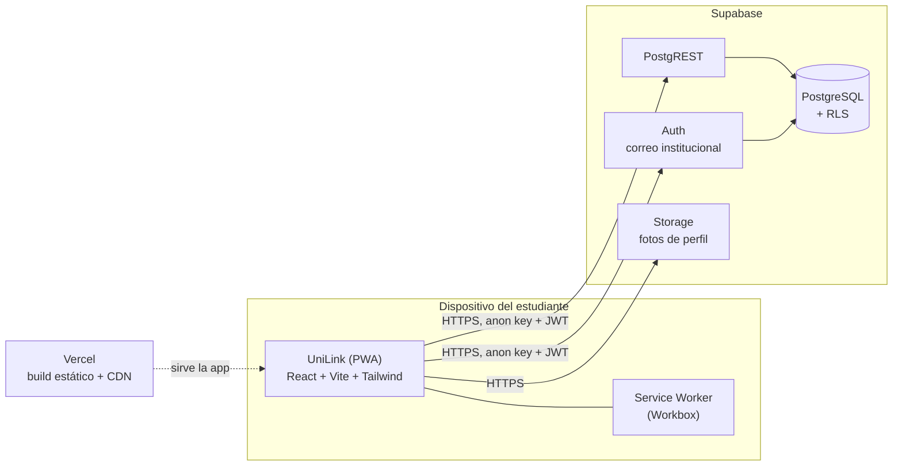
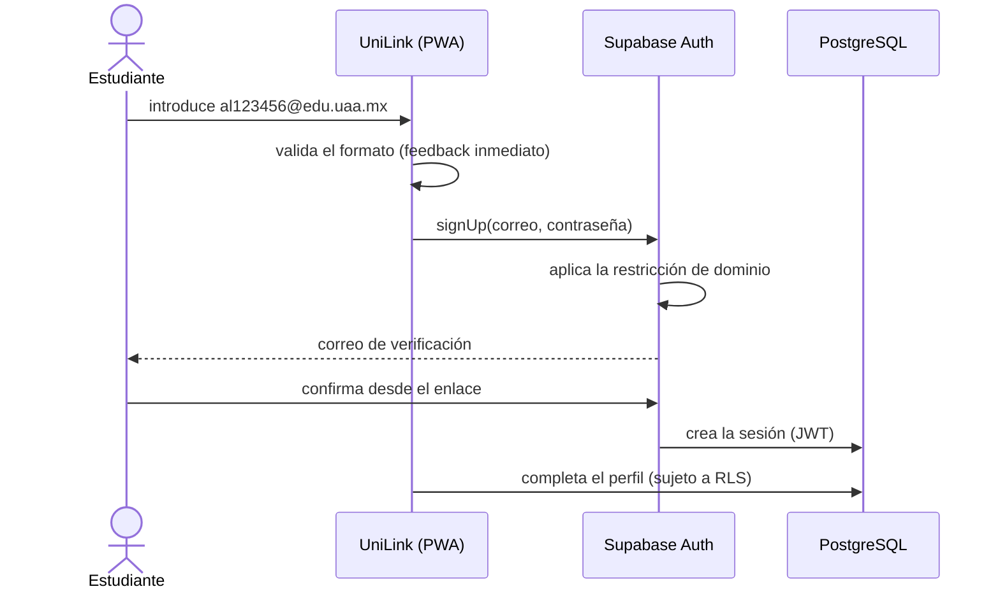

# 01 · Arquitectura

## Visión general

**No hay backend propio.** El navegador habla directamente con Supabase usando la `anon key` y
el JWT de la sesión. La consecuencia es la decisión estructural más importante del proyecto:

> **La RLS de PostgreSQL es la única frontera de seguridad de los datos.** Cualquier regla que
> se aplique solo en el cliente es una sugerencia que cualquiera puede saltarse con una petición
> HTTP directa.

Cuando aparezca una regla que no pueda expresarse como política de RLS (por ejemplo, hablar con
una API externa usando una clave secreta), su lugar será una Edge Function de Supabase o una
función serverless de Vercel — nunca el cliente.

## Flujo de registro y verificación

La validación del formato ocurre **dos veces a propósito**: en el cliente para dar feedback
inmediato, y del lado de Supabase porque es la única que de verdad obliga. Ambas parten de la
misma definición (`frontend/src/lib/auth/correo-institucional.ts`); duplicar la expresión
regular es una de las reglas duras del proyecto.

El mecanismo concreto —correo de verificación de Supabase o Google OAuth restringido al
dominio— sigue **abierto**: ver [`adr/001-verificacion-correo-institucional.md`](adr/001-verificacion-correo-institucional.md).

## Modelo de datos previsto (MVP)

Todavía no existe ninguna migración. La forma prevista:

| Tabla | Contenido | Quién puede leerla |
| --- | --- | --- |
| `perfiles` | Nombre, foto, centro universitario, referencia al usuario de Auth | Estudiantes autenticados |
| `categorias` | Catálogo de categorías de gustos | Todos los autenticados |
| `gustos` | Los gustos de un perfil, con su categoría y —opcional— su origen externo | Estudiantes autenticados |

Cada una nace con su RLS y sus políticas en la misma migración. `gustos` guarda desde el
principio el hueco para un identificador de fuente externa, de modo que integrar Spotify o TMDB
más adelante no obligue a migrar los datos existentes.

## Despliegue

| Entorno | Cómo se construye | Datos |
| --- | --- | --- |
| Local | `npm run dev` o `docker compose up` | `supabase start` (contenedores locales) |
| Preview | Vercel, automático en cada PR | Proyecto de Supabase de desarrollo |
| Producción | Vercel, automático al mergear a `main` | Proyecto de Supabase de producción |

En Vercel, `Root Directory` es `frontend`. Las variables `VITE_*` se configuran por entorno en
el panel de Vercel; **jamás** en el repositorio.

`main` debe estar protegida exigiendo los checks de CI: sin eso, el pipeline informa pero no
impide desplegar código roto.
