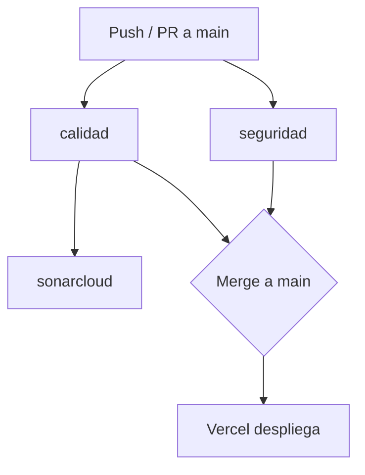

# 03 · Calidad, seguridad y CI

Tres barreras, cada vez más lejos de quien escribe el código: **el editor**, **el commit** y
**el pipeline**. Cuanto antes salta un problema, más barato es.

## 1. En el editor

ESLint + Prettier + Tailwind IntelliSense + SonarQube for IDE, con corrección automática al
guardar (`source.fixAll.eslint`). Es también lo que permite a un agente de IA ejecutar "arregla
el lint" y que quede aplicado. Extensiones en [`.vscode/extensions.json`](../.vscode/extensions.json).

`errorlens` no es un capricho: pinta el diagnóstico sobre la línea, y un error que se ve es un
error que se corrige.

## 2. En el commit — `pre-commit`

```bash
bash scripts/setup-dev-hooks.sh   # instalar (una vez por clon)
pre-commit run --all-files        # ejecutar todo manualmente
```

| Hook | Qué comprueba |
| --- | --- |
| Higiene (`pre-commit-hooks`) | Espacios, saltos de línea, YAML/JSON válidos, conflictos sin resolver, llaves privadas, archivos enormes |
| `gitleaks` | Secretos y credenciales en el diff |
| `shellcheck` | Scripts de `scripts/` (usa el binario del sistema; se omite con aviso si no está instalado) |
| `frontend-lint` | ESLint sobre `frontend/src` (se omite con aviso si no hay `node_modules`) |
| `agents-sync` | Que `AGENTS.md` siga siendo copia exacta de `.agents/AGENTS.md` |
| `conventional-pre-commit` | Formato del mensaje de commit |

## 3. En el pipeline — GitHub Actions

[`.github/workflows/ci.yml`](../.github/workflows/ci.yml), en `push` y `pull_request` sobre
`main`. Las ejecuciones en curso de la misma rama se cancelan al llegar un push nuevo.



| Job | Pasos | Bloquea |
| --- | --- | --- |
| `calidad` | `npm ci` → `lint` → `typecheck` → `test:ci` (con cobertura) → `build` | Sí |
| `sonarcloud` | Analiza el código y consume el LCOV de `calidad` | Se omite si falta `SONAR_TOKEN` |
| `seguridad` | `gitleaks` + Hadolint + ShellCheck + `trivy fs` sobre dependencias | Gitleaks, Hadolint y ShellCheck sí; Trivy es informativo (`exit-code: 0`) al inicio |

### Por qué ShellCheck y Hadolint no usan sus hooks oficiales

Ambos se distribuyen como hooks que corren dentro de Docker. Bajo **podman con SELinux** —el
entorno habitual del equipo— montar el repositorio lo reetiqueta como `container_file_t` con
categorías MCS privadas del contenedor, y la siguiente ejecución ya no puede leer los archivos
(`openBinaryFile: permission denied`). El árbol de trabajo queda reetiquetado hasta que se
ejecuta `restorecon -F -R .`.

Por eso ShellCheck usa aquí el binario del sistema y Hadolint se comprueba solo en el pipeline,
donde el contenedor es efímero y no hay tree que estropear. El reparto es el de siempre:
**local rápido y tolerante, CI exhaustivo y sin excepciones.**

Hay hueco preparado para más jobs: pruebas end-to-end, Lighthouse/PWA y auditoría de
accesibilidad son los candidatos naturales cuando existan pantallas.

### Antes de que el CI sirva de algo

1. **`SONAR_TOKEN` y el análisis automático apagado** (ver la sección de SonarCloud).
2. **Proteger `main`.** *Settings → Branches → Branch protection rules*, exigiendo los checks
   `calidad` y `seguridad`. Sin esto el pipeline informa, pero Vercel despliega igual.

## SonarCloud

[`sonar-project.properties`](../sonar-project.properties) analiza `frontend/src`, excluye
pruebas y código generado, y lee la cobertura de `frontend/coverage/lcov.info`.

El proyecto ya está conectado: `ArielParra_UniLink` en la organización `arielparra`
([panel](https://sonarcloud.io/project/overview?id=ArielParra_UniLink)).

Quedan dos pasos en la interfaz de SonarCloud:

1. **Añadir `SONAR_TOKEN`** a *Settings → Secrets and variables → Actions* en GitHub. Mientras no
   exista, el job se salta con un aviso en lugar de fallar.
2. **Desactivar el Análisis Automático.** Al conectar un repositorio desde GitHub, SonarCloud lo
   activa por defecto, y es **incompatible con el análisis desde CI**: si ambos están activos, el
   job falla con *"You are running CI analysis while Automatic Analysis is enabled"*. Se apaga en
   *Administration → Analysis Method*, dejando solo *CI-based analysis*.

Se prefiere el análisis desde CI porque es el único que recibe el informe de cobertura: el
automático no ejecuta las pruebas, así que reportaría 0% para siempre.

Conecta también la extensión del editor al mismo proyecto: así ves antes de commitear
exactamente lo que marcará el pipeline.

## Despliegue

Lo hace la integración Git de Vercel: preview por cada PR, producción al mergear a `main`.
`Root Directory` = `frontend`. En `ci.yml` hay un job de despliegue comentado por si algún día
se prefiere desplegar desde el CI.

## Por qué Supabase no está en `docker-compose.yml`

El stack de Supabase lo levanta su propio CLI (`supabase start`), que arranca las versiones
exactas que usa el servicio real. Replicar PostgreSQL, GoTrue, PostgREST y Storage a mano en
Compose produce un entorno que se desincroniza en cuanto Supabase actualiza una pieza, y los
fallos aparecen en producción. `docker-compose.yml` levanta **solo la web**, para quien prefiera
no instalar Node en su máquina.
